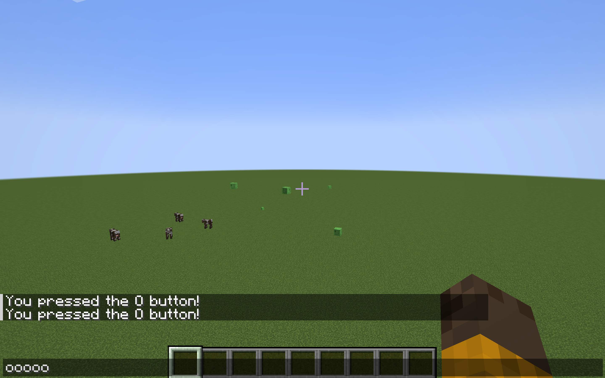

# Using Fabric
### A short guide for using the fabric framework to create simple client-side mods.

## [Example Mod used in this tutorial](https://github.com/tl0x/keybindmod)


An example of a Minecraft hacked client

## 1.0.0 Introduction

If you've ever played multiplayer Minecraft, you may have encountered a cheater using a hacked client before. You may have even used a cheat before. I certainly have. This is exactly what led to to wonder how they were made. And if you have the same question, then you have come to the right place. This guide will cover how to write client modifications for Minecraft using the Fabric framework.

## 1.0.1 Prerequisites 

To begin modding Minecraft, you need absolutely need to know how to program in Java. Knowing common OOP practices will also be very helpful. This tutorial will assume you know how to use Java and know the basics of coding.

## 1.0.1.1 A Friendly Warning

Modding Minecraft is not an easy task. You will get frustrated. Your code will sometimes not work without explanation. You will have to learn many skills before being able to mod effectively. Like any coding project, it takes time. Documentation fo the code is also lacking. 

## 1.1.0 An Introduction to Fabric

Fabric is a mod loader for Minecraft. Unlike most mods, Fabric does not overwrite class files (source bytecode) to add more functionality. It instead uses a library called [Mixin](https://github.com/SpongePowered/Mixin). Mixin injects bytecode during runtime instead of directly editing the source. More about mixins will be covered later.

## 1.1.1 Setting up Fabric

It is greatly recommended for beginners to use [Intellij IDE](https://jetbrains.com). It is always possible to use other IDEs, but most modders opt for Intellij. Before you start modding, also install the [Minecraft Development Plugin](https://plugins.jetbrains.com/plugin/8327-minecraft-development) for Intellij. Now, clone and import the [example mod](https://github.com/FabricMC/fabric-example-mod) into Intellij. Intellij will then start importing this project. Doing this the first time takes a considerable amount of time, so be patient.

## 2.0.0 Starting to Mod

Now, after gradle finishes building, navigate to the ``ExampleMod.java`` file. It should look something like this.

```java
package com.example;

import net.fabricmc.api.ModInitializer;

import org.slf4j.Logger;
import org.slf4j.LoggerFactory;

public class ExampleMod implements ModInitializer {
	// This logger is used to write text to the console and the log file.
	// It is considered best practice to use your mod id as the logger's name.
	// That way, it's clear which mod wrote info, warnings, and errors.
    public static final Logger LOGGER = LoggerFactory.getLogger("modid");

	@Override
	public void onInitialize() {
		// This code runs as soon as Minecraft is in a mod-load-ready state.
		// However, some things (like resources) may still be uninitialized.
		// Proceed with mild caution.

		LOGGER.info("Hello Fabric world!");
	}
}
```

The function ``public void onInitalize()`` is the code that will run when **Fabric loads your code**. It will only run once at the start of runtime, so beware of that. Now, before writing anything, let us run fabric to make sure everything is working smoothly.


Select the **Minecraft Client** configuration and then click the green play button (to the right of the dropdown box).

# 2.1.0 Mixins

Now navigate to the ``ExampleMixin.java`` file. Your code should look similar. Additional comments are included for clarity.

```java
package com.example.mixin;

import net.minecraft.server.MinecraftServer;
import org.spongepowered.asm.mixin.Mixin;
import org.spongepowered.asm.mixin.injection.At;
import org.spongepowered.asm.mixin.injection.Inject;
import org.spongepowered.asm.mixin.injection.callback.CallbackInfo;

@Mixin(MinecraftServer.class) // Injected into the MinecraftServer.class
public class ExampleMixin {

	@Inject(at = @At("HEAD"), method = "loadWorld")  // This @Inject statement is required. It indicates what function and where you want to inject the code. In this case, @At("HEAD") indicates you want to inject code at the start of the loadWorld() function.
	private void init(CallbackInfo info) {
		// This code is injected into the start of MinecraftServer.loadWorld()V. This code will run everytime the game runs MinecraftServer.loadWorld()V.
	}
}
```

This is the fun part. Mixins are everything to a fabric mod. It is the actual place where code is modified in Minecraft. This example mixin will run the code in the function ``private void init(CallbackInfo info)`` every time the server loads a world. Mixins are complex. A more complete explanation of them can be found in the [fabric wiki]("https://fabricmc.net/wiki/tutorial:mixin_introduction").

# 2.1.1 Reading Source Code

Half of Minecraft modding is knowing how Minecraft works. Luckily, fabric has tools for us to easily read source code. Let's say I want to know the inner workings of how a players health is updated client side. It would be as simple as searching for the ``ClientPlayerEntity`` class and finding the ``updateHealth()`` function.

```java
public void updateHealth(float health) {
        if (this.healthInitialized) {
            float f = this.getHealth() - health;
            if (f <= 0.0F) {
                this.setHealth(health);
                if (f < 0.0F) {
                    this.timeUntilRegen = 10;
                }
            } else {
                this.lastDamageTaken = f;
                this.timeUntilRegen = 20;
                this.setHealth(health);
                this.maxHurtTime = 10;
                this.hurtTime = this.maxHurtTime;
            }
        } else {
            this.setHealth(health);
            this.healthInitialized = true;
        }

    }
```

# 2.2 Using Mixins to solve a problem

Suppose we want to use solve a simple problem; we want to show a message everytime we press the letter 'O' in game. Lets create a java file called ``KeyBindMixin.java`` in the ``mixin.client`` folder. **IN THE CLIENT FOLDER, NOT THE MAIN FOLDER**. Then let's set our target on the most logical target, the ``onKey`` function. If you've done it right, the code should like this, with no errors.

```java
package com.example.mixin.client;

import net.minecraft.client.Keyboard;
import org.spongepowered.asm.mixin.Mixin;
import org.spongepowered.asm.mixin.injection.At;
import org.spongepowered.asm.mixin.injection.Inject;
import org.spongepowered.asm.mixin.injection.callback.CallbackInfo;

@Mixin(Keyboard.class)
public class KeybindMixin {
    @Inject(at=@At("HEAD"), method="onKey")
    public void onKey(long window, int key, int scancode, int action, int modifiers, CallbackInfo ci) {

    }
}
```

But then we run into a problem. We don't know *how to detect if a key is pressed*, or how to differientiate between an 'A' input or an 'O' input, or if the function gets called when a key gets pressed or released, for example. To solve this problem, we need to know more about the game. A simple search shows that Minecraft uses the LWJGL (Lightweight Java Game Library). LWJGL uses GLFW, an OpenGL library. Looking at the [GLFW wiki](https://www.glfw.org/docs/3.3/group__keys.html) for keyboard inputs and the [input reference](https://www.glfw.org/docs/3.3/group__input.html), we see that the code "O" has a keycode of 79, and that a keypress has an action code of 1. Great! Let's add that to the code.  


```java
package com.example.mixin.client;

import net.minecraft.client.Keyboard;
import net.minecraft.client.MinecraftClient;
import net.minecraft.text.Text;
import org.spongepowered.asm.mixin.Mixin;
import org.spongepowered.asm.mixin.injection.At;
import org.spongepowered.asm.mixin.injection.Inject;
import org.spongepowered.asm.mixin.injection.callback.CallbackInfo;

@Mixin(Keyboard.class)
public class KeybindMixin {
    @Inject(at=@At("HEAD"), method="onKey")
    public void onKey(long window, int key, int scancode, int action, int modifiers, CallbackInfo ci) {
        if (key == 79 && action == 1) {
            MinecraftClient.getInstance().player.sendMessage(Text.of("You pressed the O button!"));
        }
    }
}
```
Now, let's do some thinking. This code will run everytime the game detects a key. We want to send a message everytime a player hits the "O" button in game. What problems could this cause? Well, sometimes a player isn't in game. Recklessly calling functions when a player isn't in game can cause a ``NullPointerException``. Likewise, when a player is typing in chat, typing, "O", often, it will annoy the player. We need to account for that. This requires more knowledge of Minecraft's ``Screen`` system. However, going into everything about how Minecraft works would take years. So for now, we just need to check whether the ClientPlayer is null and whether or not the player has chat open.

Final Code
```java
package com.example.mixin.client;

import net.minecraft.client.Keyboard;
import net.minecraft.client.MinecraftClient;
import net.minecraft.client.gui.screen.ChatScreen;
import net.minecraft.text.Text;
import org.spongepowered.asm.mixin.Mixin;
import org.spongepowered.asm.mixin.injection.At;
import org.spongepowered.asm.mixin.injection.Inject;
import org.spongepowered.asm.mixin.injection.callback.CallbackInfo;

@Mixin(Keyboard.class)
public class KeybindMixin {
    @Inject(at=@At("HEAD"), method="onKey")
    public void onKey(long window, int key, int scancode, int action, int modifiers, CallbackInfo ci) {
        if (key == 79 && action == 1) {
            if (MinecraftClient.getInstance().player != null && !(MinecraftClient.getInstance().currentScreen instanceof ChatScreen)) {
                MinecraftClient.getInstance().player.sendMessage(Text.of("You pressed the O button!"));
            }
        }
    }
}
```

This code will now send the "You pressed the O button!" message everyime we press O in game. Nice. Now let's test our mod by running the client and hopping into a world.


After pressing O several times in our world, we see that our mod doesn't work. Did we program the mod incorrectly? No! We just forgot to register our mixin.

## 2.2.1 Registering Mixins

**This is important**. Before you test any code in a mixin, make sure to register it in ``modid.client.mixins.json``. If you do not register it, fabric will simply ignore your mixin. You cannot imagine how much headache was caused by simplying forgetting this simple fact when I was just starting out. Save yourself the headache. Below is how it should look like after registering.

```json
{
	"required": true,
	"package": "com.example.mixin.client",
	"compatibilityLevel": "JAVA_17",
	"client": [
		"ExampleClientMixin",
		"KeybindMixin"
	],
	"injectors": {
		"defaultRequire": 1
	}
}
```

Now that our mixin is registered, lets try again.

# Success!



We can now see that our mod works without error. 

## 3.0.0 Further Learning

Throughout the tutorial, you may have encountered some things that don't make sense, and that's okay. I didn't learn this instantly either. Now it is up to you to learn and read the source code yourself. Find other peoples code. Read the fabric wiki. All that stuff. 

## 3.0.1 Making non-client side mods

You may have realised that I haven't taught you how to make anything cool, like adding blocks or tools. That is because those mods cannot be done purely client side. The [fabric wiki](https://fabricmc.net/wiki/tutorial:sidebar?s[]=adding&s[]=blocks) has multiple good resources if you want to make non-clientside mods.

## 3.0.2 Useful classes for client-side mods

- ``MinecraftClient.class`` - The most important class. Many important and useful fields and methods.
- ``ClientPlayerEntity.class`` - Crucial for how the player is handled client side
- ``GameRenderer.class`` - Absolutely crucial if you want your mod to render anything
- ``Mouse.class`` - Can be used to detect mouse input
- ``Screen.class`` - Need to edit anything on 
- ``TitleScreen.class`` - Need to edit anything on the TitleScreen? Look for a method in this class.
- ``PlayerEntity.class`` - Shared code on how Players are handled
- ``Keyboard.class`` - Used earlier. Good for detecting keybinds.

## 4.0 Further Reading

- [Fabric Wiki](https://fabricmc.net/wiki) - Although a little lacking on client-side resources, it is crucial if you want to make any non-client side mod.


Thanks for reading my little tutorial on client-side mods! Have a good day!
